  

## Hi, I'm Martin Morfe

### A visual artist who writes code — and a computer engineer who paints.

I paint traditionally — watercolor, acrylic, pencil — and I study **Computer Engineering at Universidad Valle del Momboy** (Venezuela). I live at the point where those two worlds meet: I design clothing brands with an artist's eye and build the software that takes them to production with an engineer's discipline.

I work for **international clients** — the **United States**, the **United Kingdom** and **Singapore** — from high-end events in Singapore to memorial pieces delivered in New York, and fashion labels in **Hawaii** such as **Sunner.co**.

  

### What I'm doing now

- **Leading Morfe Maison** — a 4-person studio on Upwork focused on **tech packs**, **clothing brand creation** and **web design**. Top Rated, 20 jobs delivered.
- **Building** [TechPack AI Builder](https://github.com/morfemartin/techpack-ai-builder) — an open-source, multi-garment tech pack generator with AI-assisted intake, translation and a flexbox-style SVG layout engine.
- **Studying** Harvard **CS50** — Introduction to Computer Science.
- **Open to** full-time roles and collaborations where design and engineering overlap: creative tooling, design systems, fashion tech.

  

<h3 align="center">Certifications</h3>

| | Certification | Issuer |
|:-:|---|---|
|  | **Graphic Design** | CalArts · Coursera |
|  | **Project Management** | Google · Coursera |
|  | **Claude & AI courses** | Anthropic |
|  | **Full Stack Development** | Oracle Next Education · Alura |
|  | **CS50** — *in progress* | Harvard University |

<h3 align="center">Languages</h3>

  
  
  
  
  
  

<h3 align="center">Engineering</h3>

  
  
  
  
  
  
  

<h3 align="center">Design, Illustration &amp; Video</h3>

  
  
  
  
  
  
  

<h3 align="center">AI Tools</h3>

  
  
  
  
  
  
  

<h3 align="center">Work with me</h3>

  

  
  
  

 

  

